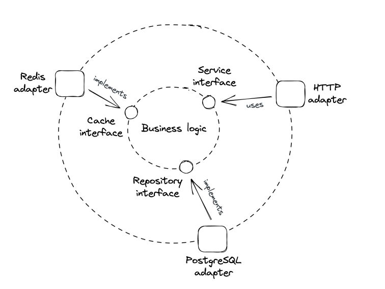

# Introduction

- [Preface](#preface)
- [Communication](#communication)
- [Coordination](#coordination)
- [Scalability](#scalability)
- [Resiliency](#resiliency)
- [Maintainability](#maintainability)
- [Anatomy of a distributed system](#anatomy-of-a-distributed-system)

## Preface

What is a distributed System?


A distributed system is a group of nodes (machines), communicating over some channel to accomplish a task.
A **node** can refer to:
 - a physical machine, like a computer or phone
 - Or a software process, like a browser

Why bother building distributed systems?
 * Some apps are inherently distributed - e.g. the web.
 * To achieve high availability and resiliency - if one node fails, the system doesn't crash.
 * To tackle data-intensive workloads which can't fit on a single machine.
 * Performance requirements - e.g. Netflix streams moveies to your tv at high resolutions thanks to serving you from a datacenter close to you.

The book focuses on tackling the fundamental problems one faces when designing a distributed system.

# What are some challenges or aspects of building distributed systems?
## 1.1 Communication
First challenge is for nodes to communicate with each other over the network:
 * How are request/response messages represented on the wire?
 * What happens when there is a temporary network outage?
 * How to avoid man in the middle attacks?

In practice, a nice network library can abstract away those details, but oftentimes abstractions leak and you need to know how the networks work under the hood.

## 1.2 Coordination
Some form of coordination is required to make two nodes work together.

Good metaphor - the [two generals problem](https://en.wikipedia.org/wiki/Two_Generals%27_Problem).

Two generals need to agree on a time to make a joint attack on a city.  There is some distance between the armies (network), and the only way to communicate is via messengers, who can be captured by the enemy (network failure). All messages between them can be intercepted & dropped.
How to ensure they attack the city at the same time, despite the faulty communication medium?

Because coordination is such a key topic, the second part of the book is dedicated to understanding the fundamental distributed algorithms used to implement it.

## 1.3 Scalability
The performance of an application represents how efficiently it can handle load. **Load** is anything that consumes the system’s (computer) resources such as Central Processing Unit (CPU), memory, and network bandwidth. 

Ways to measure it depends on the app's use-case — number of concurrent users, number of reads/writes, requests per second (RPS), etc.

For the type of applications covered in the book, load is measured in:
 * Throughput - the number of requests per second (RPS) the application can process.
 * Response time - the time elapsed in seconds between sending a request and receiving a response.

As **load** increases, the **application** will eventually reach its ***capacity***, i.e., the maximum **load** it can withstand, when a **resource** is **exhausted**. The **performance** either plateaus or worsens at that point.

When the application reaches a certain threshold in terms of **load**, throughput starts degrading, eventually hitting a point where most operations fail or time out:


The capacity depends on a system's architecture, implementation, physical limitations (eg CPU, Memory, etc).

For an application to be scalable, a load increase should not degrade the application’s performance. This requires increasing the capacity of the application at will.

An easy way to fix this is to buy more expensive hardware - scaling up. This scaling mechanism has a limit, though, since you can't scale hardware without bounds.

The alternative is to scale horizontally by adding more machines which work together.

The rise of cloud providers has made procuring additional machines trivial. They include the ability to rent virtual machines. The number of cloud providers and cloud services has only grown, democratizing the ability to create scalable applications.

## 1.4 Resiliency
A distributed system is resilient if it doesn't crash even when failures happen.

**At scale**, every **component** has a probability of failing — **nodes** can crash, **network links** can be severed, etc. The **failure** of one **component** can increase the probability that another one will fail if the **components** are not well isolated.

**Failures** that are left unchecked can impact the **system’s** **availability**, i.e., the percentage of time the **system** is **available** for use.

It’s a ratio defined as the amount of time the **application** can serve **requests** (***uptime***) divided by the total time measured (***uptime*** plus ***downtime***, i.e., the time the **application** can’t serve **requests**).

```
availability = uptime / total time
total time = uptime + downtime
```

Availability is often described with nines, a shorthand way of expressing percentages of availability. Three nines are typically considered acceptable by users, and anything above four is considered to be highly available.


There are various techniques one can use to increase availability. All of them try to mitigate failures when they inevitably come up - fault isolation, self-healing mechanisms, redundancy, etc.

A distributed system needs to embrace failures and be prepared to withstand them using techniques such as redundancy, fault isolation, and self-healing mechanisms, etc.

## 1.5 Maintainability
Most of the cost of software is spent after its initial development in maintenance activities (eg. fixing bugs, adding new features, operating it). 

We should aspire to make our systems easy to modify, extend and operate so that they are easy to maintain.

Good testing (unit, integration, and end-to-end tests) is a minimum requirement to modify or extend a system without worrying it will break. 

And once a change has been merged into the codebase, it needs to be released to production safely without affecting the system’s availability.

Operators need to monitor the system’s health, investigate degradations and restore the service when it can’t self-heal. This requires altering the system’s behavior without code changes, e.g., toggling a feature flag or scaling out a service with a configuration change.

Historically, developers, testers, and operators were part of different teams, but nowadays with the rise of microservices and DevOps, they’re on the same team.

## 1.6 Anatomy of a distributed system
From a hardware perspective, a distributed system is a set of machines communicating over network links.
From a runtime perspective, it's a group of software processes which communicate via ***inter-process communication*** (IPC) mechanisms like **HTTP**. 

From an implementation perspective, it's a group of loosely-coupled components which communicate via APIs.

All are valid points of view on the system & the book will switch between them based on context.

A service implements one specific part of the overall system's capabilities. At its core sit the business logic, which exposes interfaces to communicate with the outside world. 

Some interfaces define the operations that the service offers to its users. Others define the operations that the service can invoke on other services, like data stores (databases), message brokers, another service in the system, etc.

Since processes can’t call each other’s interfaces directly, ***adapters*** are needed to connect **IPC** **mechanisms** to service interfaces.

An inbound adapter is part of the service’s ***Application Programming Interface*** (**API**); it handles the requests received from an **IPC mechanism**, like **HTTP**, by invoking operations defined in the service interfaces.

Outbound adapters grant the business logic access to external services, like data stores.

The interfaces are implemented by adapters which implement the technical details of connecting to the external systems.

This architectural pattern is known as [ports and adapters](http://wiki.c2.com/?PortsAndAdaptersArchitecture)

This architectural style accomplishes a setup in which the business logic don't depend on the technical details. Instead, technical details depend on business logic - dependency inversion:
